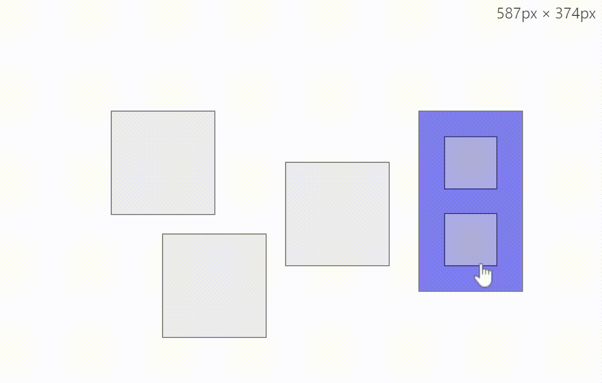

# React-rnd-group

This project demonstrates how to extend [react-rnd](https://github.com/bokuweb/react-rnd) for group resizing and dragging with hierarchical transformations, implemented using matrix manipulations.

| file                | Descriptions                                                                   |
| ------------------- | ------------------------------------------------------------------------------ |
| `Node.js`           | Handles all calculations for groups.                                           |
| `Nodes.js`          | Handles user interactions, including selecting and deselecting items.          |
| `DraggableNode.js`  | The component using react-rnd.                                                 |
| `useForceUpdate.js` | Triggers re-renders to calculate the correct transform when some item changes. |
| `data.js`           | Describes the coordinates of the items for this demo.                          |

# Demo

